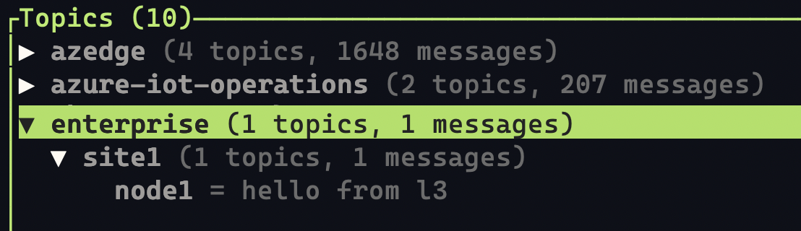

# Implementing ISA-95 with Azure IoT Operations: LNM & MQ

ISA-95, also known as ANSI/ISA-95, is an international standard developed by the International Society of Automation (ISA). It provides a framework for integrating enterprise systems (Level 4 and above) with industrial control systems (Levels 0-3). This standard aims to facilitate seamless communication and data exchange between different layers of the manufacturing hierarchy.

**Objectives of ISA-95:**

- Establish consistent terminology for clear communication between suppliers and manufacturers.
- Provide standardized information models for data exchange.
- Define consistent operations models to clarify application functionality and information usage.

**ISA-95 Levels:**

The ISA-95 standard is structured into distinct levels:

- **Level 5**: Enterprise Business Planning
- **Level 4**: Site Business Planning
- **Level 3**: Manufacturing Operations Management
- **Level 2**: Supervisory Control
- **Level 1**: Basic Control
- **Level 0**: Processes

## Features

<u>**Example**: Contoso Company Implementation</u>

Contoso, a global manufacturing company, has implemented ISA-95 using Azure IoT Operations. Their architecture aligns with the ISA-95 levels:

- **Level 5 (Global Corporation)**: Data aggregation, analysis, forecasting, and business decision-making. Some data from this layer, must to be available in bottom layers, like **Level 3** for immediate actions.
- **Level 4 (Regional Management)**: Regional production planning and coordination.
- **Level 2 & 3 (Site Operations)**: Azure IoT Edge devices collect and aggregate data from local sensors and machines. These data is stored inside the local MQ Broker. This data must reach the **Level 5** for business driving purposes.

Azure IOT Operations bundles many components, like the Azure IoT MQ: aka AIO MQ features an enterprise-grade, standards-compliant MQTT Broker that is scalable, highly available and Kubernetes-native. It provides the messaging plane for Azure IoT Operations, enables bi-directional edge/cloud communication and powers event-driven applications at the edge.

Contoso Corp, will use on the Azure IoT Operations MQ as an MQTT Broker. Then to implement the MQTT Data duplication between MQTT Brokers in different layers, Contoso will rely on the MQTT Bridge component from AIO MQ.

Contoso Corp has an additional requirement: it has a Kafka Broker deployed in another cloud, storing business decisions that need to be applied to production lines. This data needs to reach Layer 2 & 3.

## Scenario

### Kafka Bridging scenario

The first part of the document covers a setup for deploying a Kafka Connector component from AIO MQ, to grab the business decisions from the Kafka Broker hosted on the second cloud. The Kafka Connector will make the messages available in the `enterprise/feedback` topic in L4 MQTT Broker, to be used later by the MQTT Bridge.

### MQTT Bridging scenario

The second part of the document describes a setup for deploying MQTT on L4 and L3 and briding MQTT messages between L3 and L4 brokers. When an MQTT client publishes a message in the `node1` topic in L3 MQTT Broker, the MQTT Bridge will duplicate the message into the `enterprise/site1/node1` in the L4 MQTT Broker. And when a message is inserted in the `enterprise/feedback` topic in L4 MQTT Broker, the MQTT Bridge will duplicate the message into the `incoming-feedback` in the L3 MQTT Broker.

The full scenario covered in this sample is described in this sequence diagram:

[](https://mermaid.live/edit#pako:eNqtVE1zmzAQ_Ssanf2FEZhwyExsXzJ12nSSU4aLLNauxkaiQjRxPP7vXQdsYwN1JxNOsPv27du3QlsqdAw0pBn8zkEJmEq-NDyJFMHHSrsGMjYyXkq1JDOXPPx8fiZTbjmxur8wOiEzFqkCPddvZMY3YMiwCKTcWClkypUlPx4nZAp_pIAiByq-rHLrVWXH1kShrZ2SNVSyNkpWp6zmv_HFipOJVgqE1aahpzVcZVgCiL57z00Dycxr6f6oX1Hv-L6B9k5p-wuTk7XO4zZdY6NXUBVVvJ771L29LQMhecrnmTByDm1A1gJknwZ6zcALYxFZHakGP52k6jj3KgNjyQNkGV8CkQoPaCoFiajCA-5E9GzM7qm01BeS7_BKkrIcHZcLKbiVWl3zZ5qn6z0UCG7pKODj3zhI6JcaMIBfeDzApEZm0M-kBad_rrDVtv9o9G_qwxmrOVyal9TNWwDEcy5WB4pqXffIc9zdNRfrq26wsWGHlbkuFZUEX7FR97rRLVKKxUoldIIXZfeUoB2agEm4jPGO3e4bRxRJE4hoiK8xLHi-tvtZdgjludVPGyVoaE0OHZqnMaoor-RDEH_6F62rnzTc0jcadp3haNDz3SEb-Tdu4PiB36EbjDO3x4KRNwhu3MHIG_kB23Xo-wfHsMeGzmAQeIEfBK7HvN1fZevxXA)

### Requirements

This sample requires:

- Installing Azure IoT Operations on an ISA95 architecture
- Access to a Kafka Broker:
  - Kafka Broker URL and SASL Plain credentials are needed

### Implementation

#### Layer 4

In the Layer 4, we need to:

- Create the Kafka Connector and the Kafka Topic Mapper
- Configure the LNM to expose the MQTT Broker
- In the LNM DNS definition, add a custom domain name for the MQTT Front-End Service. We will use the custom domain `aio-mq-dmqtt-frontend.contoso-corp.com` for accessing the L4 MQTT Broker from the L3 Layer.

##### Creating the Kafka Connector

Azure IoT Operations MQ come with a dedicated component for duplicating data between a Kafka Broker and the AIO MQ instance. Typically our Kafka Connector will look like:

```yaml
apiVersion: mq.iotoperations.azure.com/v1beta1
kind: KafkaConnector
metadata:
  name: my-eh-connector
  namespace: azure-iot-operations
spec:
  image:
    pullPolicy: IfNotPresent
    repository: mcr.microsoft.com/azureiotoperations/kafka
    tag: 0.4.0-preview
  instances: 1
  clientIdPrefix: my-prefix
  kafkaConnection:
    endpoint: KAFKA_BROKER_URL:9093
    tls:
      tlsEnabled: true
    authentication:
      enabled: true
      authType:
        sasl:
          saslType: plain
          token:
            secretName: cs-secret
  localBrokerConnection:
    endpoint: "aio-mq-dmqtt-frontend:8883"
    tls:
      tlsEnabled: true
      trustedCaCertificateConfigMap: "aio-ca-trust-bundle-test-only"
    authentication:
      kubernetes: {}
```

This YAML defines a KafkaConnector in Azure IoT Operations to bridge data between Azure IoT MQ MQTT topics and an external Kafka broker. It sets up secure connections to both the Kafka broker and the local Azure IoT MQ MQTT broker. Authentication is handled via SASL PLAIN for Kafka and Kubernetes-based for MQTT.

This YAML example requires that the authentication credentials needs to be stored inside a Kubernetes secret, called `cs-secret`:

```bash
kubectl create secret generic cs-secret -n azure-iot-operations \
  --from-literal=username='KAFKA_USERNAME' \
  --from-literal=password='KAFKA_PASSWORD'
```

##### Creating the Kafka Connector Topic Map 

The KafkaConnectorTopicMap custom resource (CR) allows you to define the mapping between MQTT topics and Kafka topics for a possible bi-directional data transfer.

The scenario covered in this sample can be implemented using this YAML:

```yaml
apiVersion: mq.iotoperations.azure.com/v1beta1
kind: KafkaConnectorTopicMap
metadata:
  name: my-eh-topic-map
  namespace: azure-iot-operations
spec:
  kafkaConnectorRef: my-eh-connector
  routes:
    # Pull from kafka topic "feedback" and publish to MQTT topic "enterprise/feedback"
    - kafkaToMqtt:
        name: "route1"
        consumerGroupId: mqConnector
        kafkaTopic: feedback
        mqttTopic: enterprise/feedback
        qos: 1
        sharedSubscription:
          groupName: group1
          groupMinimumShareNumber: 3
```

##### Updating the Default BrokerListener

Inside Azure IOT Operations, the MQTT is deployed using many CRDs (custom resource definitions) and Kubernetes objects. The first component that we need to update is the "BrokerListener": component responsible for handling incoming MQTT Broker requests.

When you deploy Azure IoT Operations Preview, the deployment also creates a BrokerListener resource named `listener` in the `azure-iot-operations` namespace. This listener is linked to the default Broker resource named `broker` that's also created during deployment. The default listener exposes the broker on port `8883` with TLS and SAT authentication enabled. The TLS certificate is automatically managed by `cert-manager`. Authorization is disabled by default.

To inspect the listener, run:

```bash
kubectl get brokerlistener listener -n azure-iot-operations -o yaml > brokerlistener.yaml
```

The `brokerlistener.yaml` file should look like this:

```yaml
apiVersion: mq.iotoperations.azure.com/v1beta1
kind: BrokerListener
metadata:
  name: listener
  namespace: azure-iot-operations
spec:
  brokerRef: broker
  authenticationEnabled: true
  authorizationEnabled: false
  port: 8883
  serviceName: aio-mq-dmqtt-frontend
  serviceType: clusterIp
  tls:
    automatic:
      issuerRef:
        group: cert-manager.io
        kind: Issuer
        name: mq-dmqtt-frontend
```

In this file, we need to add the domain names that we want the LNM to be routing for this BrokerListener.

The first step is to get the LNM service internal K8s Address, to get it, list the K8s Services in the `azure-iot-operations`:

```bash
kubectl get services -n azure-iot-operations
```

The output of the command will list many `services`, and the one we target looks like:

```bash
NAME                     TYPE           CLUSTER-IP      EXTERNAL-IP     PORT(S)                                      AGE
...
aio-mq-dmqtt-frontend    ClusterIP      10.43.18.50     <none>          8883/TCP                                     40m
...
lnm-level-4              LoadBalancer   10.43.139.62    10.1.1.4        80:30530/TCP,443:31117/TCP,10000:31914/TCP   40m
```

We need to take note of the `CLUSTER-IP` of the:

- `aio-mq-dmqtt-frontend` service, in this example it's: `10.43.18.50`.
- `lnm-level-4` service, in this example it's: `10.43.139.62`.

Here we need to add the `aio-mq-dmqtt-frontend` domain name. The updated `brokerlistener.yaml` file looks like:

```yaml
apiVersion: mq.iotoperations.azure.com/v1beta1
kind: BrokerListener
metadata:
  name: listener
  namespace: azure-iot-operations
spec:
  brokerRef: broker
  authenticationEnabled: true
  authorizationEnabled: false
  port: 8883
  serviceName: aio-mq-dmqtt-frontend
  serviceType: clusterIp
  tls:
    automatic:
      issuerRef:
        group: cert-manager.io
        kind: Issuer
        name: mq-dmqtt-frontend
      san:
        dns:
        # list the domain names that can be used while trying 
        # to reach the `aio-mq-dmqtt-frontend` service
        - aio-mq-dmqtt-frontend.contoso-corp.com
        - aio-mq-dmqtt-frontend.azure-iot-operations.svc.cluster.local
        - aio-mq-dmqtt-frontend.azure-iot-operations
        ip: ["10.43.139.62"] # The lnm-level-4 service Cluster-IP address
```

After making the modifications, you need to apply the modifications using the command:

```bash
kubectl apply -f brokerlistener.yaml
```

Then the `brokerlistener` will be updated.

##### Updating the LNM CRD definition

While installing the Azure IOT Operations, we defined in the L4, the authorized domains for LNM.

To get the current definition of the LNM, run:

```bash
kubectl get lnm level4 -n azure-iot-operations -o yaml > lnm-crd.yaml
```

In this file we need to add the custom domain `aio-mq-dmqtt-frontend.contoso-corp.com` to the `Lnm` CRD:

```yaml
spec:
  allowList:
    domains:
    - destinationUrl: "aio-mq-dmqtt-frontend.contoso-corp.com:8883"
      destinationType: internal 
```

> Important: Be sure to include the port number, here `8883` along to the domain name, here `aio-mq-dmqtt-frontend.contoso-corp.com`.

The updated `lnm-crd.yaml` file looks like:

```yaml
apiVersion: layerednetworkmgmt.iotoperations.azure.com/v1beta1
kind: Lnm
metadata:
  name: level4
  namespace: azure-iot-operations
spec:
  image:
    pullPolicy: IfNotPresent
    repository: mcr.microsoft.com/oss/envoyproxy/envoy-distroless
    tag: v1.27.0
  replicas: 1
  logLevel: "debug"
  openTelemetryMetricsCollectorAddr: "http://aio-otel-collector.azure-iot-operations.svc.cluster.local:4317"
  level: 4
  allowList:
    enableArcDomains: true
    domains:
    - destinationUrl: "*.ods.opinsights.azure.com"
      destinationType: external
# ...
    - destinationUrl: "aio-mq-dmqtt-frontend.contoso-corp.com:8883"
      destinationType: internal
# ...
```

Now update the LNM CRD using the command:

```bash
kubectl apply -f lnm-crd.yaml
```

Then, after some time, check the LNM Service using the command:

```bash
kubectl get services -n azure-iot-operations


NAME            TYPE             CLUSTER-IP        EXTERNAL-IP     PORT(S)                                                       AGE
lnm-level-4     LoadBalancer     10.43.139.62      10.1.1.4        80:30530/TCP,443:31117/TCP,8883:31982/TCP,10000:31914/TCP     95s
```

You will notice that the port `8883` gets added to the available ports in the `lnm-level-4` service.

> TIP: in some cases the `lnm` pods are not recreated immediately. You can do it manually by using the commands:
>
> ```bash
> kubectl rollout restart deployment/aio-lnm-level4 -n azure-iot-operations
> ```

#### Configure CoreDNS on Level 4 Cluster

Then we need to add the `aio-mq-dmqtt-frontend.contoso-corp.com` domain name to the L4 K8s CoreDNS definitions. We need to create an override ConfigMap to the CoreDNS default one:

Create a file called `coredns-custom.yaml` that has this content:

```yaml
apiVersion: v1
kind: ConfigMap
metadata:
  name: coredns-custom
  namespace: kube-system
data:
  log.override: |
    log
  custom.server: |
    aio-mq-dmqtt-frontend.contoso-corp.com:53 {
      hosts {
        10.43.136.72 aio-mq-dmqtt-frontend.contoso-corp.com
        fallthrough
      }
    }
```

Given:

- `10.43.18.50` is the `aio-mq-dmqtt-frontend` service IP that we gathered in the previous step.

Then import this Custom ConfigMap using:

```bash
kubectl apply -f coredns-custom.yaml
```

Check the CoreDNS logs to make sure that the customization have been applied:

```bash
kubectl logs -n kube-system -l k8s-app=kube-dns
```

##### Export the root CA Certificate Public Key

In order to access the L4 MQTT Broker from outside the Kubernetes Cluster, in our case from L3 K8s Cluster, we need to export the L4 root CA certificate. The root CA certificate is stored in a Kubernetes `secret` called `aio-ca-key-pair-test-only`.

To export the public portion of the root CA, use this command:

```bash
kubectl get secret aio-ca-key-pair-test-only -n azure-iot-operations -o jsonpath='{.data.tls\.crt}' | base64 --decode > Certificate.crt
```

We need then to copy the file to the L3 VM using the command:

```bash
scp -i <L3-SSH-KEY-PATH> Certificate.crt <L3-USERNAME>@<L3-IP>:/<path/to/user/home>
```

#### Layer 3

##### Import the L4 root CA Certificate

In order to enable the L3 MQTT Bridge communication with the L4 MQTT Broker, we need to import the root CA Certificate in a `ConfigMap`:

```bash
kubectl create cm ca-cert-configmap --from-file=ca.crt=Certificate.crt -n azure-iot-operations
```

##### Create the MQTT Bridge Connector

The MQTT Bridge definition looks like:

```yaml
apiVersion: mq.iotoperations.azure.com/v1beta1
kind: MqttBridgeConnector
metadata:
  name: site1-mqtt-bridge
  namespace: azure-iot-operations
spec:
  image: 
    repository: mcr.microsoft.com/azureiotoperations/mqttbridge 
    tag: 0.4.0-preview
    pullPolicy: IfNotPresent
  protocol: v5
  bridgeInstances: 1
  clientIdPrefix: site1-L4-gateway-
  logLevel: debug
  remoteBrokerConnection:
    endpoint: aio-mq-dmqtt-frontend.contoso-corp.com:8883
    tls:
      tlsEnabled: true
      trustedCaCertificateConfigMap: "ca-cert-configmap"
    authentication:
      systemAssignedManagedIdentity:
        audience: https://eventgrid.azure.net
  localBrokerConnection:
    endpoint: aio-mq-dmqtt-frontend:8883
    tls:
      tlsEnabled: true
      trustedCaCertificateConfigMap: aio-ca-trust-bundle-test-only
    authentication:
      kubernetes: {}
```

With:

- The `metadata.name` and `clientIdPrefix` values contains the current site name (`site1`), to ensure uniqueness.

> NB: Azure IoT MQ generates a client ID for each `MqttBridgeConnector` client, using a prefix that you specify, in the format of `{clientIdPrefix}-{routeName}`. **This client ID is important for Azure IoT MQ to mitigate message loss and avoid conflicts or collisions with existing client IDs since MQTT specification allows only one connection per client ID**.

##### Create the MQTT Topic Mapper

The MQTT Topic Mapper looks like:

```yaml
apiVersion: mq.iotoperations.azure.com/v1beta1
kind: MqttBridgeTopicMap
metadata:
  name: site1-topic-map
  namespace: azure-iot-operations
spec:
  mqttBridgeConnectorRef: site1-mqtt-bridge
  routes:
    - direction: local-to-remote
      name: site1-to-l4
      qos: 1
      source: data
      target: data/site1
      sharedSubscription:
        groupMinimumShareNumber: 1
        groupName: "site1-to-l4-group"
    - direction: remote-to-local
      name: feedback-data-from-l4-to-site1
      qos: 1
      source: enterprise/feedback/site1
      target: feedback
      sharedSubscription:
        groupMinimumShareNumber: 1
        groupName: "feedback-data-from-l4-to-site1-group"
```

With:

- The `metadata.name` and `spec.routes.[].sharedSubscription.groupName` values contains the current site name (`site1`), to ensure uniqueness.

> NB: Shared subscriptions help Azure IoT MQ create more clients for the MQTT bridge. You can set up a different shared subscription for each route. Azure IoT MQ subscribes to messages from the source topic and sends them to one client at a time using round robin. Then, the client publishes the messages to the bridged broker.

### Testing

#### Message duplication from L3 to L4

##### In the Layer 4

From: <https://learn.microsoft.com/en-us/azure/iot-operations/get-started/quickstart-add-assets>

Install MQTT client in the k8s cluster:

```bash
kubectl apply -f https://raw.githubusercontent.com/Azure-Samples/explore-iot-operations/main/samples/quickstarts/mqtt-client.yaml
```

Enter shell environment in the MQTT client:

```bash
kubectl exec --stdin --tty mqtt-client -n azure-iot-operations -- sh
```

Enter the MQTT browsing tool:

```bash
mqttui -b mqtts://aio-mq-dmqtt-frontend:8883 -u '$sat' --password $(cat /var/run/secrets/tokens/mq-sat) --insecure
```

##### In the Layer 3

Start by deploying a non-TLS MQTT Broker Listener:

```yaml
apiVersion: mq.iotoperations.azure.com/v1beta1
kind: BrokerListener
metadata:
  name: "non-tls-listener"
  namespace: azure-iot-operations
spec:
  brokerRef: "broker"
  authenticationEnabled: false
  authorizationEnabled: false
  port: 1883
  serviceName: aio-mq-dmqtt-frontend
  serviceType: clusterIp
```

Expose the L3 MQTT Service from the Kubernetes cluster to the `localhost`:

```bash
kubectl port-forward service/aio-mq-dmqtt-frontend 12345:1883 -n azure-iot-operations
```

Then using the Eclipse Mosquitto cli (or any MQTT Client Tool) publish a message to the `local-data` topic:

```bash
mosquitto_pub -d -h localhost -p 12345 -i "l3-client" -t "local-data" -m "Hello from L3"
```

Then in the L4 MQTTUI tool you will see the `Hello from L3` message appearing in the L4 `enterprise/site1/node1` topic:



#### Message duplication from L4 to L3

To test the messages duplication from L4 to L3:

**In the Layer 3**:

Deploy the MQTT Client container and run the `mqttui` tool

**In the Layer 4**:

- Deploy non-TLS MQTT Broker Listener  
- Expose the MQTT service port locally
- Publish message to the `enterprise/feedback` topic

Then, in the L3 `mqttui` tool, you will see the message coming from L4 to the topic `incoming-feedback`.

## Additional links

- [Secure Azure IoT MQ Preview communication using BrokerListener](https://learn.microsoft.com/en-us/azure/iot-operations/manage-mqtt-connectivity/howto-configure-brokerlistener)
- [Connect Azure IoT MQ Preview MQTT bridge cloud connector to other MQTT brokers](https://learn.microsoft.com/en-us/azure/iot-operations/connect-to-cloud/howto-configure-mqtt-bridge)
- [Test connectivity to Azure IoT MQ Preview with MQTT clients](https://learn.microsoft.com/en-us/azure/iot-operations/manage-mqtt-connectivity/howto-test-connection)
